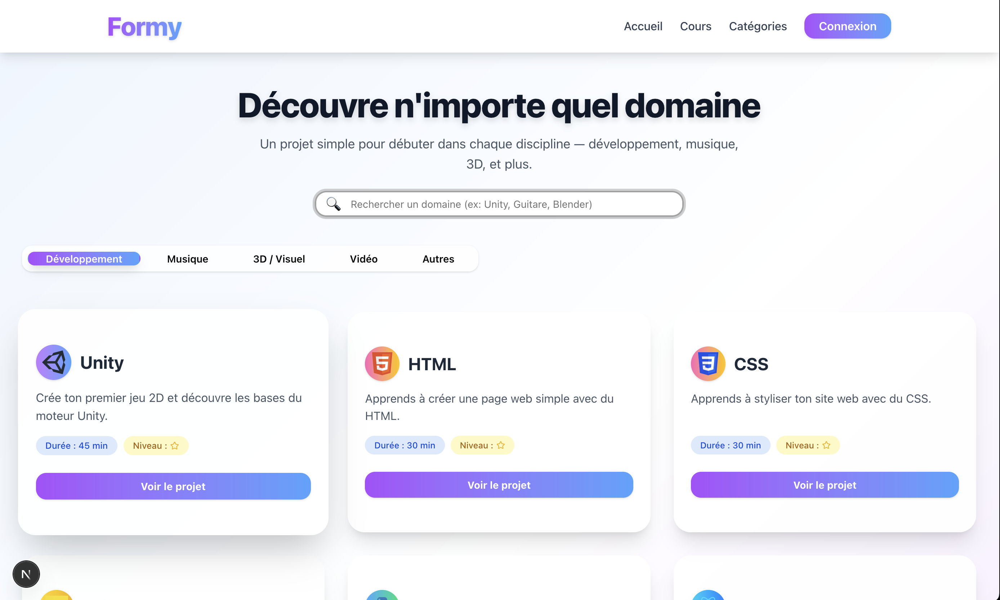

# Formy – Plateforme de découverte de projets créatifs

Bienvenue sur **Formy**, la plateforme moderne pour découvrir, apprendre et s’initier à de nombreux domaines créatifs : développement, musique, 3D, vidéo, design, et plus encore !

---

## 🚀 Lancer le projet en local

### Prérequis
- Node.js >= 18
- pnpm (ou npm/yarn)

### Installation

1. Clone le dépôt :
   ```bash
   git clone <url-du-repo>
   cd Formy
   ```
2. Installe les dépendances :
   ```bash
   pnpm install
   # ou
   npm install
   # ou
   yarn install
   ```
3. Lance le serveur de développement :
   ```bash
   pnpm dev
   # ou
   npm run dev
   # ou
   yarn dev
   ```
4. Ouvre [http://localhost:3000](http://localhost:3000) dans ton navigateur.

---

## ✨ À propos du projet

Formy est une application Next.js qui propose :
- Un design premium, moderne et responsive
- Un moteur de recherche intelligent avec suggestions visuelles
- Des cartes interactives pour chaque domaine (Développement, Musique, 3D, Vidéo…)
- Des pages de cours premium pour chaque application (Unity, Blender, Premiere Pro, etc.)
- Navigation fluide et expérience utilisateur optimale

### Fonctionnalités principales
- Découverte de projets par domaine
- Recherche instantanée avec suggestions et logos
- Accès direct à des mini-cours guidés pour chaque logiciel
- Interface claire, accessible et agréable

### Pourquoi utiliser Formy ?
- Pour s’initier rapidement à de nouveaux outils créatifs
- Pour centraliser l’accès à des ressources de qualité
- Pour donner envie d’apprendre par la pratique
- Pour promouvoir la diversité des disciplines numériques

---

## 🌟 Promotion

> **Formy** – La plateforme qui donne envie d’apprendre et de créer !
>
> - Découvre des domaines variés (dev, musique, 3D, vidéo…)
> - Lance-toi sur des projets concrets, même sans expérience
> - Profite d’un design moderne et d’une navigation ultra-fluide
> - Idéal pour les débutants, les curieux et les créatifs

**Testez Formy dès maintenant et révélez votre potentiel créatif !**

---

## 📸 Aperçu visuel



---

## 🛠️ Stack technique
- Next.js 15
- React 18
- Tailwind CSS
- Prisma (si backend activé)
- Auth NextAuth.js (si besoin)

---

## 📬 Contact
Pour toute question, suggestion ou collaboration : esteban.h0207@gmail.com
